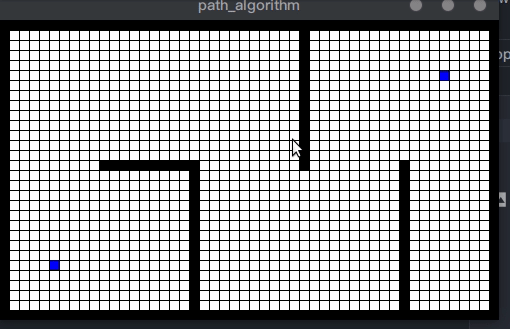

# 结果

## Best-First

伪代码

```pseudocode
procedure GBS(start, target) is:
  mark start as visited
  add start to queue
  while queue is not empty do:
    current_node ← vertex of queue with min distance to target
    remove current_node from queue
    foreach neighbor n of current_node do:
      if n not in visited then:
        if n is target:
          return n
        else:
          mark n as visited
          add n to queue
  return failure 
```



## 参考

> https://en.wikipedia.org/wiki/Best-first_search
> 